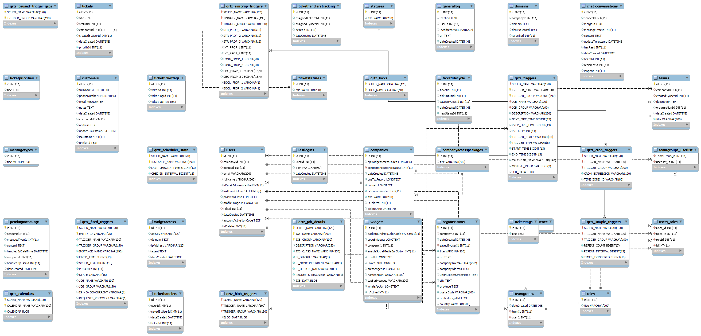

Welcome to the **Click To Call** or click2call  business solution project .

To understand the technical side of the project please make sure you have an understanding of the following :

- [WebRTC](https://webrtc.org/)
- [NodeJS](https://nodejs.org/en/)
- [Docker](https://www.docker.com/)
- [PM2](https://pm2.keymetrics.io/)
- [Ubuntu Apache](https://ubuntu.com/tutorials/install-and-configure-apache#1-overview)  , [PHP](https://www.php.net/)
- [Microservices](https://microservices.io/)
- [MariaDB a SQL database ](https://mariadb.org/)
- [Fast API](https://fastapi.tiangolo.com/)
- [GitHub Action](https://github.com/features/actions)
- [Springboot](https://spring.io/projects/spring-boot)
- [Janus WebRTC Server](https://janus.conf.meetecho.com/) 
- [AWS Dev Ops [not really required] ](https://aws.amazon.com/console/)
- [WebSockets](https://developer.mozilla.org/en-US/docs/Web/API/WebSocket) ,  [App logic example sample](https://www.cometchat.com/tutorials/how-to-build-a-chat-app-with-websockets-and-node-js)
- [Socket IO](https://socket.io/docs/v4/)

Repositories about this App find them here- https://github.com/kinsleykajiva?tab=repositories&q=click2call&type=&language=&sort= 

This application is an application that aims to create support centers backend that has an Adminstrator view or side .
This app is similar to apps like [Consolto](https://www.consolto.com/) or [jivochat](https://www.jivochat.com/) .
How it works is that :
A customer with a website that seeks to provide support to clients via the website can install this
app by adding the widget on the target website of the customer ,this widget will be added as a script tag at the bottom of the page .

The widget will need to be hosted remotely to where is easy and publicly accessible as a javascript library , so having CDN access can help a lot .
This widget will be a support chat box that allows the visitors of the site to add their contacts , and have a chat Also this widget will allow voice call / video call/ Screen Sharing session as well.

On the Admin Side of the app the Agents or admin users can see these queues of users and will choose who to chat with and who to assaign to
,The agent/admin users can accept a chat session as ticket .The system automatically creates once a user is taken by an agent .

Schema -

.....

